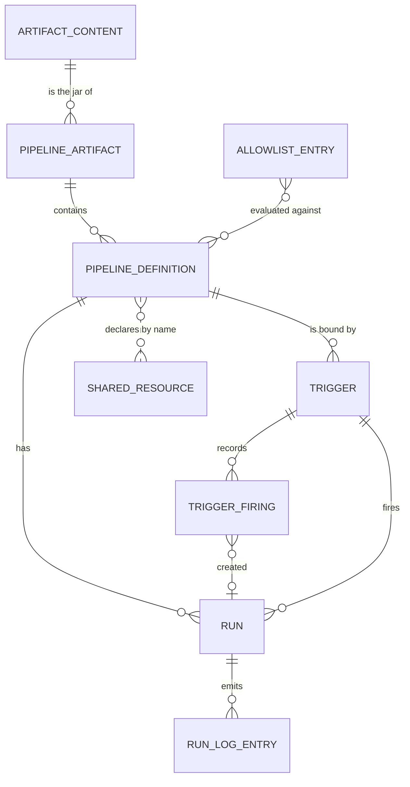

# 資料模型

本文回答：有哪些主要實體、如何關聯、資料如何保存。使用 PostgreSQL。

## 實體關係

Pipeline 定義與共享資源之間以名稱鬆散關聯（虛線）：定義宣告資源名稱，資料庫不以外鍵連結兩者。

## 實體說明

| 實體 | 內容 | 備註 |
|---|---|---|
| Artifact Content | jar 位元組、內容雜湊、大小 | 以內容雜湊為鍵，同一內容只存一份；不可變；最後一個參照它的版本被刪除時，在同一交易內移除（[ADR-020](adr/ADR-020-per-uploader-artifact-versions.md)） |
| Pipeline Artifact（版本） | 內容雜湊（參照 Artifact Content）、上傳者、上傳時間 | 不可變；（內容雜湊，上傳者）唯一，同一內容可有多個版本、每位上傳者最多一個；definition、trigger、run 仍以版本的代理鍵參照 |
| Pipeline Definition | 名稱、所屬 artifact、宣告的 metadata（含宣告的資源名稱）、safe／unsafe 判定、原因與依賴路徑、判定時使用的白名單版本（文字；白名單由資料庫管理之前儲存的判定為 `config`）、是否允許以 unsafe 執行及設定者與設定時間 | 同名 pipeline 隨 artifact 版本並存；同一 artifact 內，pipeline 名稱與類別名稱各自唯一；判定與 unsafe 設定逐版本獨立保存，不繼承、不共享（同一內容的不同上傳者各有一份），預設不允許 |
| Trigger | 管理員指定的唯一名稱、類型（cron／webhook）、目標 pipeline 定義、固定參數（原樣保存）、啟用旗標、建立者與修改者及時間；cron：五欄表達式與時區；webhook：密鑰雜湊與最近輪替時間 | 由管理員維護；名稱用於網址與 run 的來源名稱；只存密鑰的雜湊，不存明文；cron 與 webhook 欄位互斥 |
| Trigger Firing | 所屬 trigger、觸發時間、cron 的排程時間或 webhook 的 delivery 識別碼、結果（待處理、已建立 run、被拒絕、失敗、中斷）、原因與說明、所建立的 run | 同一 trigger 內 delivery 識別碼唯一、排程時間唯一，由資料庫保證；只記錄 cron 觸發與已通過驗證的 webhook 呼叫；run 被清理時此紀錄保留並清除其 run 參照 |
| Run | 狀態、觸發來源（手動時為呼叫者名稱，trigger 時為該 trigger）、參數、起訖時間、結果與失敗原因、是否為 unsafe 執行及當時的設定、設定者與時間 | 狀態含：排隊、等待資源、初始化、執行中、逾時未結束、成功、失敗、取消、中斷、逾時。「逾時」是 run 本體逾時後以失敗結束的終態；等待資源逾時屬於「失敗」，失敗原因註明等待資源逾時 |
| Run Log Entry | 所屬 run、序號、時間、輸出串流、內容 | 序號在 run 內從 1 起遞增 |
| Allowlist Entry | 種類（套件或類別，各有欄位區分）、名稱、是否「僅此套件」（只用於套件）、建立者與時間、最後修改者與時間 | 同一種類內名稱唯一；整份白名單有版本，版本另存一張歷史表（版本號、變更者與時間、動作、說明、該版本重判了多少定義與其中多少變成 unsafe／safe）；版本從 1 起，每次條目變更加 1；變更後立即重判 |
| Shared Resource | 名稱、型別（`counter`、`file`、`jdbc-pool`、`openai-compatible`，建立後不可改）、容量、啟用旗標、型別專屬的非機密設定、機密別名、最近一次實體檢查的結果與時間、建立者與時間、修改者與時間 | 由管理員維護；名稱為識別；機密值不入庫，只存金鑰庫別名（[ADR-019](adr/ADR-019-typed-shared-resources.md)）；設定或別名被修改時，最近一次檢查結果清除；持有者與等待者是執行期狀態，存於 Engine 記憶體，不入庫 |

## 一致性與交易邊界

- 上傳：內容（若尚未存在）、上傳者的版本與其下所有 definition 在同一交易內寫入，要嘛全成功要嘛全失敗。同一上傳者重複上傳相同內容由（內容雜湊，上傳者）的唯一性保證冪等，並行下仍只有一個版本。
- 內容的寫入與版本的刪除以內容雜湊為鍵取同一把交易層級 advisory lock：刪除最後一個版本時移除內容，與並行的上傳互斥，不會出現版本指向已不存在的內容（外鍵以「拒絕刪除」參照內容，作為第二道保證）。
- Run 建立與狀態轉換各為獨立交易，狀態只能單向前進。
- Webhook 去重：同一 trigger 內 delivery 識別碼唯一，由資料庫的唯一性保證，並行重送下仍只建立一個 run。
- Cron 去重：同一 trigger 內同一排程時間唯一，同樣由資料庫保證。
- 白名單變更與其觸發的重判在同一交易內完成：交易持有白名單的互斥鎖（資料庫的交易層級 advisory lock），逐一讀取已儲存的 jar、用 analyzer 重新分析並更新判定；任何失敗都使條目、版本與判定維持原狀。手動重判（不改條目、不產生新版本）同樣如此。
- 上傳寫入判定時以同一把鎖的共享模式檢查：判定所用的版本必須仍是目前版本，否則不寫入、以新版本重新判定。因此變更不會漏掉正在上傳的定義。預覽不持有鎖，在唯讀、一致的快照上進行。
- 共享資源的定義變更（含刪除）為獨立交易；pipeline 可在資源定義之前上傳，此時上傳只產生警告，不影響判定。刪除只在沒有持有者與等待者時成立；已宣告該資源的定義與 trigger 不阻擋刪除（以名稱鬆散關聯）。

## 生命週期

- Run 與 log 依保留期限清理，期限由組態決定（[WI-20](work-items/WI-20-run-retention.md)）；run 被清理時其 log 一併移除。
- 觸發紀錄依保留期限清理（[WI-20](work-items/WI-20-run-retention.md)）。webhook 的觸發紀錄同時是去重視窗，其保留期限不得短於去重視窗；刪除 trigger 時其觸發紀錄一併刪除。
- 被任何 trigger 或進行中 run 引用的版本不得刪除（他人的同內容版本被引用不阻擋這個版本被刪除）。實作上，版本刪除會連帶刪除其 definition；因此所有參照 definition 的資料表（trigger、run 等）必須以「拒絕刪除」的方式參照，被引用的 artifact 才無法刪除。共享資源以名稱參照，不屬於此類。
- 既有 artifact 於遷移時各自成為其內容雜湊的唯一版本，jar 位元組移到以內容雜湊為鍵的單一儲存（版本的代理鍵不變，definition、trigger、run 的參照不變）。
- 既有資源於遷移時全部成為 `counter` 型別；金鑰庫檔案不在資料庫，是部署的組態產物，備份與資料庫分開（[ADR-019](adr/ADR-019-typed-shared-resources.md)）。
- Artifact 儲存先放資料庫，以交易一致性與 12-Factor 無狀態為優先；體積成為問題時再評估改放物件儲存。

## 遷移策略

Schema 變更以版本化、單向前進的遷移進行。遷移是獨立的一次性步驟，使用與應用相同的程式碼與設定；Engine 啟動時只檢查 schema 是否為最新，不自行遷移，未遷移則啟動失敗。遷移檔由 tdd-coder 撰寫。
