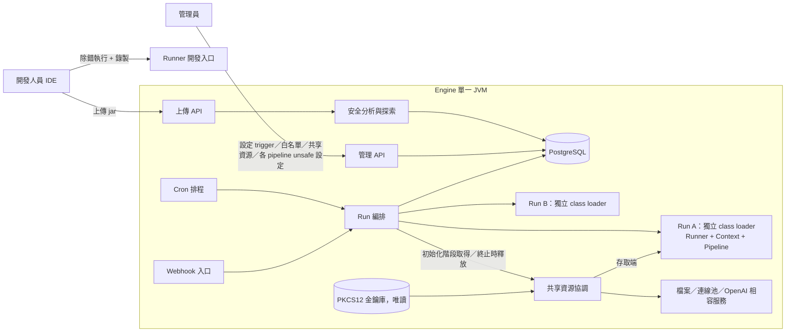

# Pipeline Execution Engine（入口文件）

狀態：已核可（2026-10-03）。本頁回答：這個系統是什麼、關鍵決策是什麼、細節在哪裡。

## 目標與範圍

- 開發人員用 Kotlin 撰寫 pipeline（風格參考 Jenkins Groovy script），編譯成 jar 發佈。
- Engine 接收 jar 上傳、判定安全等級、由 cron 與 webhook 觸發執行。
- Runner 是獨立執行器：Engine 用它執行 pipeline，開發人員在 IDE 中用它設中斷點除錯（必要功能）。
- Runner 注入受 metadata 限制的 context；開發人員用 Runner 時可錄製 IO，用來產生 metadata 提案。
- 範圍外（v1）：重放（replay）、cron／webhook 以外的 trigger、多租戶、跨 JVM／跨節點執行。

## 關鍵決策結論

| 主題 | 結論 | 詳見 |
|---|---|---|
| 隔離 | 同一個 JVM，每次 run 使用獨立的 root class loader | [ADR-001](adr/ADR-001-isolated-classloader.md) |
| 執行模型與 JDK | 每個 run 一條專屬平台 thread；JDK 基準為最新 LTS（JDK 25） | [ADR-008](adr/ADR-008-execution-model-and-jdk.md) |
| 限制與 unsafe | context 是協作式能力限制；unsafe 由 metadata 完整度、類別參照樹（含第三方）對套件白名單的比對，以及 JVM 結束成員的參照判定；core 為受信任的葉節點 | [ADR-002](adr/ADR-002-context-and-unsafe.md) |
| 發佈與探索 | jar 上傳；metadata 宣告式存在 jar 內；Engine 於上傳時不執行程式碼即可探索 | [ADR-003](adr/ADR-003-jar-and-discovery.md) |
| 錄製 | 只錄製 IO，產出 metadata 提案，不重放 | [ADR-004](adr/ADR-004-recording.md) |
| Trigger | 由管理員在 Engine 端綁定 | [ADR-005](adr/ADR-005-trigger-binding.md) |
| Unsafe 執行 | 每個 pipeline 版本各自設定是否允許，預設不允許，不繼承 | [ADR-006](adr/ADR-006-unsafe-policy.md) |
| 檔案範圍 | context 的檔案存取只限 pipeline 共享目錄與 run 私有目錄 | [ADR-009](adr/ADR-009-file-scopes.md) |
| JVM 結束呼叫 | 參照 JVM 結束成員（含 Kotlin 標準函式庫的行程結束函式）在成員層級判為 unsafe，不受套件白名單豁免；Runner 不做執行期攔截 | [ADR-011](adr/ADR-011-jvm-exit-calls.md) |
| IO 敏感成員 | 啟動行程、載入原生程式碼、基礎套件內可直接開啟檔案或網路的成員，在成員層級判為 unsafe，不受套件白名單豁免；預設白名單不含提供 IO 的套件 | [ADR-013](adr/ADR-013-io-sensitive-members.md) |
| 白名單條目 | 白名單條目可為套件或完整類別；類別條目只放行該類別，其 IO 成員仍受成員層級規則約束 | [ADR-014](adr/ADR-014-class-level-allow-list-entries.md) |
| API 認證 | 上傳與管理 API 以設定檔提供的 Bearer token 認證，兩種角色（開發人員、管理員），provider 可替換 | [ADR-012](adr/ADR-012-api-authentication.md) |
| 網路與行程比對 | 網路以主機名稱（不分大小寫、無萬用字元、不比埠號）、行程以指令第一個元素完全比對；空清單全拒絕 | [ADR-010](adr/ADR-010-access-allow-list-matching.md) |
| 共享資源 | 管理員在 Engine 定義命名資源與容量；pipeline 宣告，run 初始化階段整體取得，鎖由 Engine 持有 | [ADR-007](adr/ADR-007-shared-resources.md) |
| 型別化共享資源 | 資源有型別（`counter`、`file`、`jdbc-pool`、`openai-compatible`，封閉集合）；Engine 持有實體並以受控存取端中介，機密只存在 PKCS12 金鑰庫（維運以工具管理，Engine 唯讀加重載），資源可刪除與檢查；容量語意仍為 run 級，整體並行上限 = 容量 × 每 run 同時請求數（預設 1）；`openai-compatible` 以版本化端點目錄（涵蓋全部 OpenAI 相容端點，管理員逐條啟用，pipeline 不能自選主機、路徑與標頭）與分階段逾時（連線、首位元組、閒置、選填總時間、等待額度；串流為必要）支援長時間生成（補充 ADR-007、ADR-009） | [ADR-019](adr/ADR-019-typed-shared-resources.md) |
| 版本識別 | 版本以（內容雜湊，上傳者）識別；相同位元組由不同上傳者上傳時各自成為版本，位元組去重儲存，判定與 unsafe 設定逐版本獨立；API 仍以 `contentHash` 為主，管理員以 `uploader` 消歧義；不洩漏他人是否上傳過（修訂 ADR-003 的版本識別） | [ADR-020](adr/ADR-020-per-uploader-artifact-versions.md) |
| Console 前端 | Svelte 靜態 SPA 打包進 engine.jar，由 Engine 在 `/` 提供；同源、不啟用 CORS；首版 zh-TW 與 en | [ADR-015](adr/ADR-015-console-frontend.md) |
| 版本與 commit hash | 免認證的 `GET /api/v1/info` 公開版本與完整 hash；詳細資訊與呼叫者身分在 Bearer 的 `GET /api/v1/system`；建置時注入，發佈 jar 位元組級可重現 | [ADR-016](adr/ADR-016-engine-build-info-endpoint.md) |
| Console 的 log 與 token | log 以輪詢顯示（不用 WebSocket）；token 存 sessionStorage 並以 BroadcastChannel 跨分頁同步；登入與憑證種類脫鉤，token 登入為過渡機制 | [ADR-017](adr/ADR-017-console-websocket-and-token.md) |
| 探測端點 | 免認證的存活與就緒探測；存活不檢查依賴，就緒檢查啟動、資料庫、執行期目錄與關閉狀態；Docker 與 systemd 皆支援 | [ADR-018](adr/ADR-018-liveness-readiness-probes.md) |

## 元件關係

## 文件索引

| 章節 | 文件 | 狀態 |
|---|---|---|
| 1 需求摘要 | [01-requirements.md](01-requirements.md) | 已核可 |
| 2 現況觀察 | [02-current-state.md](02-current-state.md) | 已核可 |
| 3 方案比較 | [03-options.md](03-options.md) | 已核可 |
| 4 部署架構 | [04-deployment.md](04-deployment.md)（平台指南：[Docker](04-deployment-docker.md)、[systemd](04-deployment-systemd.md)） | 已核可 |
| 5 IPC 模型 | [05-ipc.md](05-ipc.md) | 已核可 |
| 6 資料模型 | [06-data-model.md](06-data-model.md) | 已核可 |
| 7 非功能與風險 | [07-nfr-risks.md](07-nfr-risks.md) | 已核可 |
| 8 API | [08-api.md](08-api.md) | 已核可 |
| 決策記錄（ADR-001 至 020） | [adr/](adr/) | 已核可 |
| 9 工作項 | [work-items/README.md](work-items/README.md) | 已核可 |
