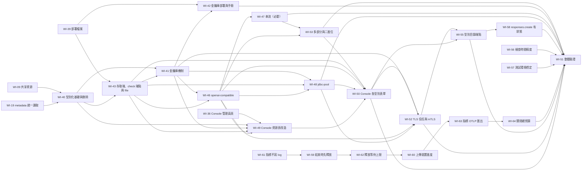

# 工作項總覽

本文回答：要交給 tdd-coder 的工作有哪些、先後順序為何。tdd-coder 只需讀本頁加被派到的那一項。狀態：已核可（2026-10-03；WI-40 至 WI-51 為 2026-10-06；WI-52、WI-53、WI-54 為 2026-10-07 納入，WI-55 至 WI-64 為 2026-10-08 納入，WI-46、WI-47 的端點目錄與逾時為 2026-10-07 修訂，皆待使用者確認）。

| 項目 | 目標 | 相依 |
|---|---|---|
| [WI-00](WI-00-template-cleanup.md) | 清除範本無關內容，建立本案的模組邊界 | 無 |
| [WI-13](WI-13-module-renaming.md) | 模組命名調整為 core、runner、engine | WI-00 |
| [WI-12](WI-12-auth-simplify-and-deprecations.md) | 簡化認證骨架並消除 deprecated 用法 | WI-00 |
| [WI-01](WI-01-pipeline-sdk.md) | Pipeline 撰寫契約：宣告、metadata、context 的 IO 類別 | WI-13 |
| [WI-02](WI-02-runner-core.md) | Runner 核心：獨立 class loader、context 限制、取消與逾時 | WI-01 |
| [WI-03](WI-03-runner-dev-entry.md) | 開發入口：IDE 中斷點除錯 | WI-02、WI-05、WI-16 |
| [WI-04](WI-04-recording.md) | IO 錄製與 metadata 提案 | WI-03 |
| [WI-05](WI-05-safety-analyzer.md) | 靜態分析與 safe／unsafe 判定 | WI-01 |
| [WI-06](WI-06-upload-and-discovery.md) | 上傳 API、探索、儲存、版本 | WI-05、WI-16 |
| [WI-07](WI-07-triggers.md) | 管理員 trigger 綁定、cron、webhook | WI-06、WI-08 |
| [WI-08](WI-08-run-orchestration.md) | Run 編排、各 pipeline 的 unsafe 設定、歷史與 log | WI-02、WI-06、WI-19 |
| [WI-09](WI-09-shared-resources.md) | 跨 pipeline 共享資源（互斥／限流） | WI-02、WI-08 |
| [WI-10](WI-10-allowlist-admin.md) | 管理員白名單設定、預設白名單與立即重判 | WI-05、WI-06、WI-21、WI-24 |
| [WI-11](WI-11-workspace-directories.md) | Pipeline 共享目錄與 run 私有目錄的建立、清除與用量 | WI-01 |
| [WI-14](WI-14-kmfmt-formatting.md) | ktfmt 格式化可用於專案 | 無 |
| [WI-15](WI-15-package-renaming.md) | 套件名稱與專案 group 調整為 dev.lawlan.runline 前綴 | 無 |
| [WI-16](WI-16-analyzer-module.md) | 靜態分析獨立為 analyzer 模組 | WI-05、WI-15 |
| [WI-17](WI-17-external-test-project.md) | 外部測試專案 runline-test，供 devkit 的 IDE 實測 | WI-03 的實作 |
| [WI-18](WI-18-upload-hardening.md) | 上傳與服務端的安全補強 | WI-06、WI-08 |
| [WI-19](WI-19-unified-metadata-reading.md) | metadata 讀取統一到 analyzer | WI-06、WI-16 |
| [WI-20](WI-20-run-retention.md) | run、log 與觸發紀錄的保留期限清理 | WI-08、WI-07 |
| [WI-21](WI-21-io-sensitive-members.md) | 靜態分析的 IO 敏感成員判定 | WI-05、WI-16、WI-19 |
| [WI-24](WI-24-class-level-allow-list.md) | 類別層級的白名單條目 | WI-21 |
| [WI-22](WI-22-surface-cleanup.md) | 對外介面清理與目錄名稱規則共用 | WI-18 |
| [WI-23](WI-23-test-stability.md) | 測試穩定性 | 無 |
| [WI-25](WI-25-allow-list-format-and-default-refinement.md) | 白名單文字格式統一與預設白名單補強 | WI-10 |
| [WI-26](WI-26-test-timeouts.md) | 測試的逾時保護 | WI-23 |
| [WI-27](WI-27-repository-baseline.md) | 版本庫的初始整理與初始 commit | 無 |
| [WI-28](WI-28-build-info-and-system-endpoints.md) | 建置資訊注入，`GET /api/v1/info` 與 `GET /api/v1/system` | WI-18、WI-27 |
| [WI-29](WI-29-health-probes.md) | 存活與就緒探測端點 | WI-08、WI-18 |
| [WI-30](WI-30-node-toolchain.md) | 開發環境的 Node 工具鏈（devcontainer、本機安裝） | 無 |
| [WI-31](WI-31-frontend-build-and-static-serving.md) | 前端建置接進 Gradle，Engine 提供靜態檔與 SPA fallback | WI-28、WI-30 |
| [WI-32](WI-32-reproducible-release-build.md) | 固定平台上位元組級可重現的發佈建置 | WI-28、WI-31 |
| [WI-33](WI-33-console-shell-and-i18n.md) | Console 骨架、設計系統、多語系基礎、不可信內容顯示機制 | WI-31 |
| [WI-34](WI-34-console-auth-boundary.md) | 認證邊界、token 登入、跨分頁工作階段、Engine 版本與 hash 標示 | WI-28、WI-33 |
| [WI-35](WI-35-console-developer-pages.md) | 開發人員功能頁：pipeline、上傳、run、log 輪詢 | WI-34 |
| [WI-36](WI-36-console-admin-pages.md) | 管理員功能頁：trigger、白名單、共享資源、unsafe 設定 | WI-35 |
| [WI-37](WI-37-console-security-verification.md) | Console 的 XSS、CSP 與 token 保存驗證 | WI-35、WI-36 |
| [WI-38](WI-38-deployment-entry-points.md) | 部署入口：從 jar 執行遷移、結束代碼、健康檢查工具評估 | WI-18、WI-29 |
| [WI-39](WI-39-deployment-files.md) | `deploy/` 的 Dockerfile、Compose 與 systemd 單元 | WI-31、WI-38 |
| [WI-40](WI-40-typed-resources-and-deletion.md) | 資源型別化基礎：型別欄位與遷移、metadata 型別宣告、`type_mismatch`、宣告者查詢、刪除與預覽 | WI-09、WI-19 |
| [WI-41](WI-41-keystore-secrets.md) | 金鑰庫機密機制（前置驗證已完成）：唯讀載入、格式與開啟失敗檢查、別名查找、機密端點與重載、不外洩（別名到資源的解析由 WI-46、WI-48 驗證） | WI-40、WI-43 |
| [WI-42](WI-42-keystore-deployment.md) | 金鑰庫的 Docker 與 systemd 掛載與維運手冊 | WI-39、WI-41 |
| [WI-43](WI-43-resource-accessor-boundary.md) | 資源存取端、檢查端點與 `file` 型別（合併原 WI-43、WI-44、WI-45）：存取端邊界與回收失效、`check` 端點與檢查結果、`file` 的資源根目錄與路徑限定與互斥與部署；通用機制以真實 `file` 驗證 | WI-39、WI-40 |
| [WI-44](WI-44-resource-check-endpoint.md) | 已併入 WI-43，不單獨派工 | 不適用 |
| [WI-45](WI-45-file-resource.md) | 已併入 WI-43，不單獨派工 | 不適用 |
| [WI-46](WI-46-openai-compatible-resource.md) | `openai-compatible` 型別（一次完整回傳）：版本化端點目錄與管理員啟用（JSON 端點）、固定與可覆寫參數、金鑰注入、錯誤分類、整體並行（容量 × 每 run 上限）、連線與首位元組與選填總時間與等待額度逾時；金鑰別名到資源的首次驗證 | WI-41、WI-43 |
| [WI-47](WI-47-openai-compatible-streaming.md) | `openai-compatible` 串流（必要，緊接 WI-46）：逐塊拉取、閒置逾時、取消與用量 | WI-46 |
| [WI-48](WI-48-jdbc-pool-resource.md) | `jdbc-pool` 型別（PostgreSQL）：連線池世代、窄 SQL 存取、資料庫設定檔機制 | WI-41、WI-43、WI-46 |
| [WI-49](WI-49-console-resources-page-rework.md) | Console 資源頁改造：型別、檢查、刪除、機密檢視、宣告者 | WI-36、WI-40、WI-41、WI-43、WI-46 |
| [WI-50](WI-50-console-typed-resource-forms.md) | Console 各型別資源表單與使用量 | WI-43、WI-46、WI-48、WI-49 |
| [WI-51](WI-51-secret-non-leak-verification.md) | 機密不外洩與型別化資源的整體驗證、文件一致性核對 | WI-42、WI-47、WI-48、WI-50、WI-52、WI-53、WI-55、WI-56、WI-57、WI-58、WI-59、WI-60、WI-61、WI-62、WI-63、WI-64 |
| [WI-52](WI-52-tls-trust-and-mtls.md) | TLS 信任與 mTLS：金鑰庫的受信任憑證與私鑰項目、`trustAliases` 與 `clientCertAlias`、到期監看、輪替、Console 顯示與欄位 | WI-41、WI-46、WI-48、WI-50 |
| [WI-53](WI-53-openai-compatible-multipart-and-binary.md) | `openai-compatible` 的多部分上傳與二進位回應：圖像、音訊、檔案端點；檔案來源與去處走 ADR-009 範圍；大小上限 | WI-46、WI-47 |
| [WI-54](WI-54-per-uploader-artifact-versions.md) | 相同位元組由不同上傳者各自成為版本（內容雜湊 + 上傳者）：位元組去重儲存、`uploader` 消歧義與 `ambiguous_version`、不洩漏他人上傳、遷移、白名單重判與刪除逐版本、Console 調整（[ADR-020](../adr/ADR-020-per-uploader-artifact-versions.md)） | WI-06、WI-07、WI-08、WI-10、WI-18、WI-35、WI-36、WI-40 |
| [WI-55](WI-55-resource-type-catalog-endpoint.md) | 資源型別目錄端點 `GET /api/v1/resource-types`：Engine 內建型別描述為唯一來源（端點目錄、請求參數、資料庫種類與允許屬性），Console 改用它並移除前端複本（[ADR-021](../adr/ADR-021-resource-type-catalog-endpoint.md)） | WI-50、WI-52 |
| [WI-56](WI-56-check-time-precision.md) | 檢查回應的時間與保存後讀回的時間完全相同 | WI-43 |
| [WI-57](WI-57-test-environment-robustness.md) | `./gradlew check` 在開發容器（以 root 執行、負載下）穩定通過；真實瀏覽器腳本的前置條件寫入文件 | WI-26 |
| [WI-58](WI-58-responses-create-stateful.md) | `responses.create` 在型別目錄中標為有狀態 | WI-55 |
| [WI-59](WI-59-run-end-ordering.md) | Run 被觀察為已結束時，存取端已失效、資源已釋放 | WI-09、WI-43 |
| [WI-60](WI-60-upload-idle-progress.md) | 上傳的閒置判定以服務端實際收下的進度計時，誤差有固定上限 | WI-53 |
| [WI-61](WI-61-metrics-log-reporter.md) | 指標不定期寫入 log，Engine 停止時停止所有指標相關背景工作 | 無 |
| [WI-62](WI-62-release-wait-limit.md) | 釋放有上限、不卡住排程；`jdbc-pool` 清理連線有逾時（承接 WI-59 第 5 條驗收條件） | WI-59 |
| [WI-63](WI-63-metrics-otlp-export.md) | 指標經 OTLP 匯出，OpenTelemetry 由 Engine 關閉，不累積關閉掛鉤 | WI-61 |
| [WI-64](WI-64-shutdown-budget-and-dev-errors.md) | 關閉寬限時間作為整個關閉流程的總預算；run 與釋放同時失敗時以 run 的失敗為主 | WI-62、WI-63 |

建議順序：WI-00 → WI-13 → WI-01（WI-12 與 WI-01 無相依，可並行）→ (WI-02、WI-05、WI-11 並行) → WI-16 → WI-03 → WI-04（WI-03 的 IDE 實測需要 WI-17 提供外部測試專案，WI-17 在 WI-03 實作完成後進行）；WI-06 → WI-19 → WI-08 → (WI-07、WI-09 並行)；WI-10 與 WI-18 在 WI-06 之後即可進行，與其他項無先後要求。WI-02 的初始化階段需要 WI-11 提供目錄位置，WI-02 與 WI-11 需一併驗收。WI-15 與其他項無相依，在尚未完成的項目之前先做，使後續項目都使用新的套件名稱。

Console 與部署相關項目（WI-28 至 WI-39，決策見 [ADR-015](../adr/ADR-015-console-frontend.md) 至 [ADR-018](../adr/ADR-018-liveness-readiness-probes.md)）的建議順序：WI-28 → WI-29 → WI-30 → WI-31 → WI-32（WI-28 與 WI-30 無相依，可並行；WI-29 與前端項目無相依，可在任何時間點進行）；WI-31 之後 WI-33 → WI-34 → WI-35 → WI-36 → WI-37；WI-29 之後 WI-38 → WI-39（WI-39 同時需要 WI-31 完成；WI-38 內的健康檢查工具選項須先經架構決定）。WI-32 與 Console 畫面項目無先後要求。WI-28 與 WI-29 完成之前，`ApiDocumentationTest` 會因 08-api 已記載尚未實作的端點而失敗，屬預期，完成後轉為通過。

型別化共享資源項目（WI-40 至 WI-53，決策見 [ADR-019](../adr/ADR-019-typed-shared-resources.md)）的建議順序：WI-40 → WI-43 → WI-41 → WI-46 → WI-47 → WI-53 → WI-48 → WI-49 → WI-50 → WI-52 → WI-55 → WI-58 → WI-56 → WI-57 → WI-61 → WI-59 → WI-62 → WI-60 → WI-63 → WI-64 → WI-51（WI-64 完成後重新驗收 WI-57，之後才派 WI-51；WI-59 的第 5 條驗收條件由 WI-62 承接，WI-62 完成時 WI-59 一併驗收；WI-62 先於 WI-60，因為 WI-59 使釋放卡住時 run 不再結束；WI-56、WI-57、WI-58 互不相依，仍一次派一項；WI-57 找出的三項產品缺陷由 WI-61、WI-59、WI-60 修正，WI-61 先做以移除測試負載的主要來源；三項完成後重新驗收 WI-57 的「`./gradlew check` 連續 3 次全部通過」，之後才派 WI-51）。WI-47（串流）是長時間生成的必要項，緊接 WI-46，兩者之間不插入其他型別項目；WI-53 在 WI-47 之後，可與 WI-48 並行，須在 WI-50 之前完成（WI-50 的端點啟用表單需要完整目錄）與 WI-51 之前完成。WI-42（部署掛載與維運手冊）在 WI-41 之後即可進行，與型別項目無先後要求，須在 WI-51 之前完成；WI-49（Console 資源頁改造）在 WI-46 之後即可，可與 WI-47、WI-48 並行，須在 WI-50 之前完成。

WI-54（版本以內容雜湊加上傳者識別，決策見 [ADR-020](../adr/ADR-020-per-uploader-artifact-versions.md)）與型別化資源鏈無相依，WI-40 之後即可進行；建議在 WI-49 之前完成，使資源頁的宣告者顯示一次到位。WI-54 含遷移與 06、08-api 的同步更新，與資源項目的遷移檔編號依實際先後排序。

WI-44 與 WI-45 已併入 WI-43，編號保留為指向 WI-43 的說明檔，不單獨派工。WI-43 一次派給 tdd-coder，內部依序 TDD：存取端邊界與回收失效 → `check` 端點與檢查結果 → `file` 型別完整行為與部署；驗收全部以真實 `file` 型別與真實檔案系統進行，型別集合封閉，不引入測試專用型別或擴充點。WI-43 排在 WI-41 之前：WI-43 不需要機密，且 WI-41 需要 WI-43 的資源根目錄組態來檢查金鑰庫位置。WI-41 的前置驗證（JDK 25 金鑰庫工具）已於 2026-10-07 完成，結果與決定見 ADR-019（機密限可列印 ASCII 等），不影響 WI-43。WI-52（TLS 信任與 mTLS）在 WI-50 之後、WI-51 之前；其待實測項目結果不如預期時停下來由架構決定。

金鑰庫機制與別名解析分兩段驗證：WI-41 以真實金鑰庫檔與端點驗證機制本身（載入、查找、列出、重載、不外洩），此時沒有任何型別接受別名；別名格式、狀態、引用者、檢查的別名缺失類別與重載後的世代切換，由第一個接受別名的型別 WI-46 驗證，WI-48 以 `jdbc-pool` 再驗證一次。WI-43 的「進行中的長時間操作被取消」由 WI-46（進行中請求）與 WI-48（進行中查詢）驗證。目標服務的端點（全部）、並行上限（1，以容量控制）與生成時間特性（長且不固定）已確認，WI-46 實作前只需確認逾時與大小上限的數值（無回覆時採 ADR-019 決定 14 的建議預設）。每個新增或變更 API 的項目在實作時同步更新 08-api，`ApiDocumentationTest` 在各項完成時保持通過；08 在對應項目完成前不列尚未實作的路由。

## 全域架構約束（適用所有項目）

- 每次 run 使用獨立 root class loader，其上層僅為 JDK 平台 class loader（[ADR-001](../adr/ADR-001-isolated-classloader.md)）。
- Engine 與 run 邊界只傳 JDK 內建型別（[05](../05-ipc.md)）。
- 探索與分析不得執行 pipeline 邏輯（[ADR-003](../adr/ADR-003-jar-and-discovery.md)）。
- 開發入口與 Engine 共用同一份 Runner 執行路徑。
- 每個 run 使用一條專屬平台 thread，不以 coroutine 執行 pipeline 本體；JDK 基準為 25（[ADR-008](../adr/ADR-008-execution-model-and-jdk.md)）。
- 跨 run 共享的狀態由 Engine 持有，不放在 run 的 class loader 內（[ADR-007](../adr/ADR-007-shared-resources.md)）。
- 開發流程遵循 TDD；範本無關內容之外的既有行為不得被破壞。
- 專案沒有 CI：所有驗證都能在本機以 Gradle 或明確的本機指令完成；測試的外部系統使用真實容器或自製的簡易真實實作（Fake），不使用 Stub 或 Mock。
- Console 只用同源的 `/api/v1`，不改變 Bearer API 契約（[ADR-012](../adr/ADR-012-api-authentication.md)、[ADR-015](../adr/ADR-015-console-frontend.md)）。
- 型別化資源由 Engine 中介：機密值只存在於金鑰庫，不進入資料庫、API、metadata、log、trace、錯誤與 Engine 與 run 的邊界；型別集合封閉，不開放外掛；容量維持 run 級持有（[ADR-019](../adr/ADR-019-typed-shared-resources.md)）。
